#  Bases de la programmation orientée objet 

### IUT Montpellier-Sète – Département Informatique

* **Cours:** [M2103](http://cache.media.enseignementsup-recherche.gouv.fr/file/25/09/7/PPN_INFORMATIQUE_256097.pdf) - support [ici](https://github.com/IUTInfoMontp-M2103/Ressources)
* **Enseignants:** [Marin Bougeret](mailto:marin.bougeret@umontpellier.fr), [Sébastien Gagné](mailto:sebastien.gagne@umontpellier.fr), [Victor Poupet](mailto:victor.poupet@umontpellier.fr), [Petru Valicov](mailto:petru.valicov@umontpellier.fr)
* Le [forum Piazza](https://piazza.com/class/jpv7gf0lltk4kc) de ce cours pour poser vos questions
* [Email](mailto:petru.valicov@umontpellier.fr) pour une question d'ordre privée concernant le cours.
* Le [sujet du projet](https://gitprint.com/IUTInfoMontp-M2103/Projet-Dominion) en format .pdf téléchargeable et imprimable.

# Projet - _DOMINION_

**Date de rendu : 15 mai 2019 à 23h59**  

Des consignes du projet vous sont données dans le fichier [Consignes.md](Consignes.md).  
_**Le non-respect de ces consignes impliquera une pénalité de 3 points minimum sur la note du projet**_ 

## Présentation
Le but de ce projet est de produire une implémentation en _Java_ du jeu de cartes [_Dominion_](http://wiki.dominionstrategy.com/index.php/Dominion).

_Dominion_ est un jeu de cartes inventé par Donald X. Vaccarino pour 2 à 4 joueurs. C'est un jeu de _construction de deck_ où les joueurs doivent à tour de rôle jouer des cartes de leur main pour obtenir de nouvelles cartes parmi un ensemble commun disponible. Lorsque la partie s'arrête le joueur possédant le plus de points de victoire dans son deck est déclaré vainqueur.

Le fichier [règles de base](ressources/sujet/Dominion-Regles-1ere-edition.pdf) contient les règles principales du jeu (première édition). Dans ce projet nous considérerons la [_Seconde Edition_](http://wiki.dominionstrategy.com/index.php/Second_Edition) du jeu où 6 cartes du jeu initial ont été remplacées par 7 autres cartes. Mis à part le changement des cartes mentionnées, les règles de base restent inchangées.

**Vous êtes encouragés à lire ces règles avant de poursuivre la lecture du sujet.**

**Remarque** : Il existe de nombreuses extensions pour _Dominion_ qui modifient considérablement les règles de base. Dans ce projet nous ne considérerons que le jeu de base.

### Les cartes

Toutes les cartes du jeu (cf. section [Liste des Cartes](#Liste-des-cartes) pour la liste complète) sont caractérisées par  
* un nom (en haut) ;
* un prix d'achat (en bas à gauche) ;
* un type (en bas) qui peut être _Trésor_, _Victoire_, _Malédiction_, _Action_, _Action/Attaque_ ou _Action/Réaction_ ;
* une description (centre) qui correspond à l'effet de la carte lorsqu'elle est jouée (_Action_ ou _Trésor_) ou comptabilisée en fin de partie (_Victoire_).

Il peut exister plusieurs copies de chaque carte mais deux cartes ayant le même nom ont des caractéristiques identiques (on dira que deux cartes identiques sont de la même _famille_).

Par ailleurs, l'ensemble des cartes utilisées est déterminé en début de partie et à tout moment de la partie chaque carte est  
* soit dans la _réserve_ (_supply_), commune à tous les joueurs et disponible à l'achat ;
* soit dans la pile de cartes _écartées_ (_trash_) ;
* soit en la possession d'un joueur.

#### La classe `Card` et ses sous-classes

Les cartes du jeu sont représentées par des objets de la classe `Card`. Pour chacune des cartes "physiques" (de la boîte du jeu _Dominion_) on associe une instance de `Card` correspondante. Ainsi, au démarrage de la partie, tous les objets `Card` sont créés et conservés durant toute la partie. Il n'y a donc pas de _création_ (ni _destruction_) de nouvelles cartes après le démarrage de la partie.

Étant donné que le _type_ d'une carte influe fortement sur la façon d'utiliser la carte, on définit une sous-classe de `Card` pour chacun des types de carte possibles. Voici un diagramme de classe **partiel** de l'hiérarchie de cartes : 

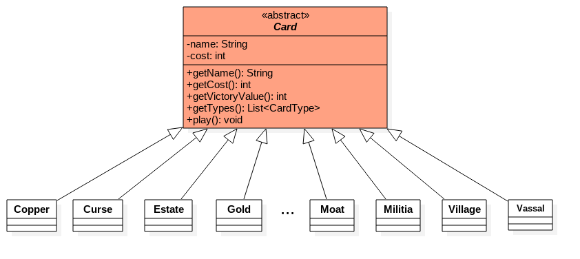

Pour des raisons de lisibilité, on ne représente pas toutes les classes de cartes sur ce dessin, mais elles sont toutes présentes dans le dépôt et vous devez toutes les programmer.

**Important** : votre code devra respecter la sémantique de cette architecture logicielle mais au besoin vous pouvez ajouter d'autres classes à ce diagramme.

#### Les listes de cartes

Afin de simplifier les tâches couramment effectuées par le jeu sur des ensembles de cartes, on définit une classe spécifique `CardList` pour représenter les listes de cartes. C'est cette classe qui est utilisée pour représenter toutes les listes de cartes en possession des joueurs (main, défausse, etc.) ainsi que les piles de la réserve et la pile de cartes écartées.

Cette classe hérite de `ArrayList<Card>` ce qui permet de l'utiliser comme un `ArrayList` (constructeurs, accesseurs, méthodes) et d'ajouter des méthodes lorsque c'est utile.

La classe `CardList` est fournie avec un certain nombre de méthodes supplémentaires déjà implémentées mais vous pouvez éventuellement ajouter d'autres méthodes si vous le jugez nécessaire.

#### Les types de cartes

Pour représenter correctement les différents types possibles des cartes, un [type énuméré](https://docs.oracle.com/javase/tutorial/java/javaOO/enum.html) `CardType` est fourni. Il contient les constantes  
* `Treasure`
* `Action`
* `Victory`
* `Curse`
* `Reaction`
* `Attack`

La méthode `getTypes()` de la classe `Card` retourne un `List<CardType>` d'éléments de ce type. Remarquez que les cartes du jeu de base peuvent avoir un ou deux types.

### Les joueurs

Les joueurs de la partie sont identifiés par un nom (de type `String`). À tout moment de la partie, les cartes que possède un joueur peuvent être dans l'un des 4 emplacements suivants :

* sa _main_ (_hand_) ;
* sa _défausse_ (_discard_) ;
* sa _pioche_ (_draw_) ;
* la liste des cartes actuellement _en jeu_ (_in play_).

L'ensemble des cartes possédées par le joueur (dans l'un des emplacements précédemment cités) constitue le _deck_ du joueur. Chaque joueur commence la partie avec 3 cartes _Estate_ et 7 cartes _Copper_ toutes mélangées et cachées dans sa défausse. Ensuite il pioche immédiatement en main 5 cartes de cette défausse de manière arbitraire.

En plus de ses cartes, un joueur a différents compteurs de ressources :

* le nombre d'_actions_ qu'il peut jouer (initialisé à 1 au début de son tour) ;
* le nombre de pièces dont il dispose pour acheter des cartes (initialisé à 0 au début de son tour) ;
* le nombre d'achats qu'il peut réaliser (initialisé à 1 au début de son tour)

#### La classe `Player`

Les joueurs participant à une partie de _Dominion_ sont représentés par des instances d'une classe `Player`. Le nom, les compteurs (actions, argent, achats), les différentes piles de cartes du joueur ainsi que la partie dans laquelle il se trouve sont représentés par des attributs de cette classe.

La figure ci-dessous illustre les attributs de la classe `Player`. Les méthodes sont nombreuseuses et c'est pour cette raison elles ne sont pas illustrées ici mais vous pouvez les voir directement dans le code et dessiner le diagramme de classes par vous-même. Beaucoup de ces méthodes sont à implémenter, lisez donc attentivement leur documentation. Vous pouvez évidemment ajouter des méthodes (publiques ou privées) si vous le jugez nécessaire.

<!--  -->

### Déroulement du tour

Le tour d'un joueur s'exécute en plusieurs étapes

  **Préparation.** Les compteurs du joueur sont remis aux valeurs indiquées par les règles : 1 pour les actions et les achats, et 0 pour l'argent.
  
  **Action.** Le joueur peut jouer des cartes _Action_ de sa main tant que son compteur d'actions est supérieur ou égal à 1. Lorsqu'une carte _Action_ est jouée, le compteur d'actions du joueur est décrémenté de 1, la carte jouée est marquée comme étant _en jeu_ et l'action de la carte est exécutée. Le joueur peut choisir de passer à la phase suivante même s'il lui reste des actions qu'il peut jouer.

  **Trésors.** Le joueur peut jouer des cartes _Trésor_ de sa main. Dans le jeu de base, il n'y a aucune situation ou le joueur aurait un intérêt à conserver des trésors dans sa main. On pourra donc considérer ici que le joueur joue automatiquement tous les trésors qu'il a en main.

  **Achats.** Le joueur peut acheter des cartes de la réserve en utilisant l'argent qu'il a amassé pendant les phases précédentes. Le joueur peut acheter une carte s'il lui reste au moins un achat et que le prix de la carte est inférieur à la somme dont il dispose. Lorsqu'il achète une carte, son compteur d'achats est décrémenté de 1, son argent est décrémenté de la valeur de la carte achetée et la carte achetée est déplacée dans la défausse du joueur. Le joueur peut choisir de terminer cette phase même s'il peut encore acheter des cartes.

  **Fin.** À la fin du tour toutes les cartes (de la main du joueur et en jeu) sont défaussées, les compteurs du joueur sont remis à 0 et le joueur pioche 5 nouvelles cartes en main. Il est important que les soient piochées à la fin du tour car la main peut être affectée pendant le tour d'un autre joueur (cf. _Militia_ ou _Moat_ par exemple).

### La partie

Une partie de _Dominion_ est représentée par une instance de la classe `Game`. C'est la partie qui gère la liste des joueurs et l'ensemble des cartes communes. Cette classe contrôle également le déroulement de la partie : mise en place, alternance des tours des joueurs et fin de partie lorsque les conditions de fin sont remplies.

Pour démarrer une partie, il faut spécifier le nombre de joueurs qui y participent ainsi que la liste des cartes à utiliser comme piles de réserve. Le code du constructeur de la classe `Game` vous est entièrement fourni (vous n'avez pas à le modifier). Il prend deux arguments en paramètres :

  **`String[] playerNames`**: la liste des noms des joueurs qui participent à la partie (c'est le constructeur de `Game` qui construit les instances de `Player` correspondantes)  
  **`List<CardList> kingdomStacks`**: une liste de piles de réserve à utiliser comme cartes _Royaume_ dans la partie. Les règles du jeu prévoient 10 piles _Royaume_ mais la partie peut fonctionner avec un nombre différent. Le constructeur de `Game` doit ajouter à ces piles les piles de réserve communes (cartes _Trésor_, _Victoire_ et _Malédiction_)

La classe `Game` est relativement simple (par rapport à `Player`). Le diagramme de classes donné ci-dessous illustre ses attributs et méthodes. Certaines d'entre vous vous sont données et les autres vous aurez à les écrire. Comme précédemment, vous pouvez ajouter d'autres méthodes si cela vous semble nécessaire.

### Interface utilisateur

L'interface utilisateur que vous aurez à gérer sera entièrement en ligne de commandes. Les informations du jeu seront affichées à l'écran en utilisant la sortie standard et les choix des joueurs se feront par lecture sur l'entrée standard (clavier). Une fois la partie lancée, toutes les interactions avec l'utilisateur se feront donc dans le terminal. Dans une partie à plusieurs joueurs, un même processus demande successivement aux joueurs de jouer leur tour dans le même terminal.  
 **Important** : le code gérant l'ensemble d'affichages utilisateur vous est fourni et vous ne devez pas le modifier.  

#### Interface graphique (web)
 Ultérieurement, une fois que votre projet aura suffisamment avancé, une interface graphique vous sera fournie. Cette interface interpretera la saisie console et affichera le jeu de manière plus proche d'un utilisateur non-informaticien. Vous n'aurez pas à la modifier (ni à adapter votre code), cette partie étant complètement indépendante de votre projet. Cette interface permettra de rendre votre projet plus ludique et pour que votre jeu rassemble à un _vrai_ jeu.
 
 **Important** : Des méthodes spéciales `String toJSON()` et `void prompt()` ont été ajoutées aux classes `Game`, `ListOfCards` et `Player`. Elle sont nécessaires pour l'IHM qui sera ajoutée ultérieurement. **Vous ne devriez pas les modifier !**
 
 **Important** : L'interface graphique sera compatible sur Linux et MacOS. Sur les autres systèmes d'exploitation, le comportement de l'IHM ne sera pas garanti. 

#### Choix

Lorsqu'un joueur doit choisir parmi un ensemble de cartes (par exemple la carte à jouer dans sa main, ou une carte à acheter dans la réserve ou encore une carte parmi deux _Trésors_ après avoir joué un _Voleur_), il devra entrer le nom exact de la carte choisie (on utilisera les noms anglais des cartes pour éviter les problèmes de caractères accentués). Par exemple, il pourra choisir `"Village"` ou `"Throne Room"`.

Pour indiquer qu'il souhaite _passer_ (par exemple parce qu'il ne souhaite pas jouer de carte _Action_, qu'il ne veut rien acheter en fin de tour ou encore s'il ne veut plus écarter de cartes après avoir joué une _Chapelle_), le joueur entrera la chaîne de caractères vide `""`.

Enfin, lorsqu'il doit faire un choix parmi deux possibilités (par exemple choisir s'il veut défausser son deck après avoir joué un _Chancellier_, ou s'il veut défausser une carte _Action_ piochée après avoir joué une _Bibliothèque_), il répondra à une question posée en entrant `"y"` pour oui et `"n"` pour non.

Le code des méthodes qui gèrent les choix vous est donné dans la classe `Player` (`choose()`, `chooseOption(...)`, `chooseCard(...)` ) et vous n'aurez pas à le modifier. (_lorsque l'IHM vous sera fournie, il faudra tout de même remplacer quelques lignes de code de ces fonctions, et on vous dira par quoi le moment venu_)

### Rendu attendu

L'intégralité du code source du projet doit résider dans le dépôt GitHub associé à votre équipe de projet. À priori vous n'avez qu'à compléter les fichiers `.java` qui vous ont été donnés.

Toutes les méthodes qui lèvent une exception avec l'instruction `throw new RuntimeException("Not Implemented")` doivent être complétées selon les spécifications (en respectant les noms et les paramètres indiqués). Vous pouvez éventuellement ajouter des attributs et méthodes aux classes, lorsque cela vous semble nécessaire. **Sauf indication de la part des enseignants, il est interdit de de moifier :**
1. **les signatures des méthodes/attributs.**
2. **le code des méthodes déjà écrites (celles qui n'ont pas de `throw new RuntimeException("Not Implemented")`)**

L'exécution de la méthode `main(String args[])` de la classe `AppDominion` (à la racine du projet) doit démarrer une partie avec un ensemble de 10 cartes _Royaume_ de votre choix. Cette fonction servira simplement à exécuter manuellement une partie et à faire des petites simulations. L'ensemble des cartes et différentes actions du jeu seront évaluées de manière automatique à l'aide des tests unitaires. Ces tests sont faits indépendamment du choix de cartes pour la partie exécutée par la méthode `main(String args[])`. Un premier jeu de tests unitaires vous est fourni dans le répertoire `src/test/java`.

#### Évaluation

L'évaluation du projet se fera à l'aide de tests unitaires automatisés. Un premier jeu de tests vous est fourni pour que vous puissiez vérifier le bon fonctionnement des fonctionnalités de base, puis nous utiliserons un second jeu de tests (secret) pour l'évaluation finale.

Il est donc attendu que les projets rendus passent le premier jeu de tests sans erreurs, mais vous devez également vérifier par vous-mêmes (en écrivant d'autres tests unitaires) que le projet se comporte correctement dans les différents cas particuliers qui peuvent se produire et qui ne sont pas nécessairement couverts par les tests qui vous ont été fournis.

### Liste des cartes

#### Cartes trésor

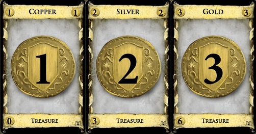

#### Cartes Victoire

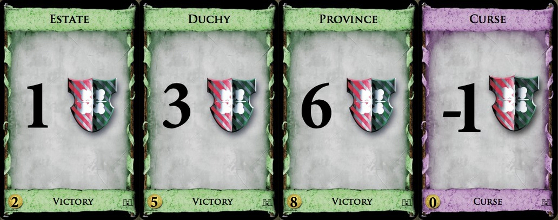
<!-- 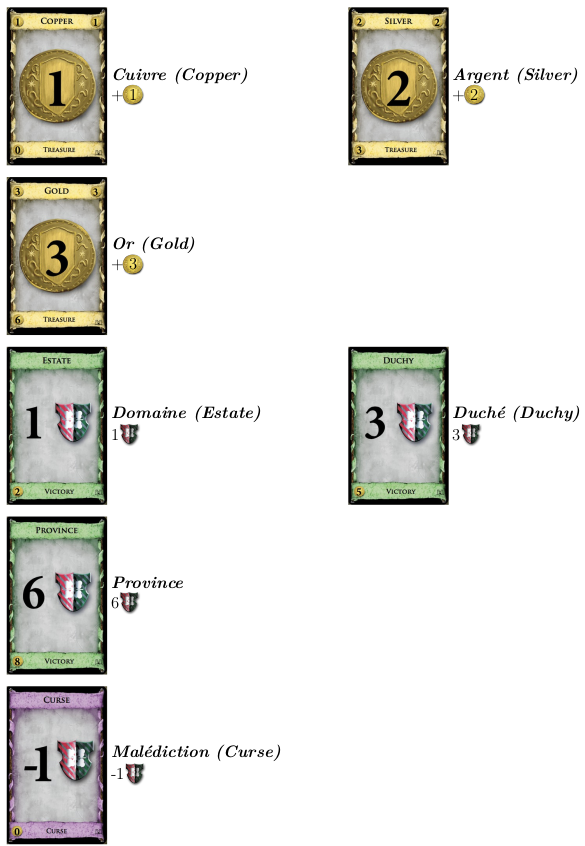 -->

<!-- 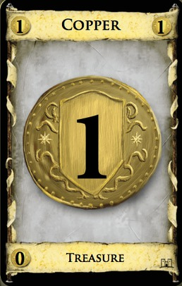
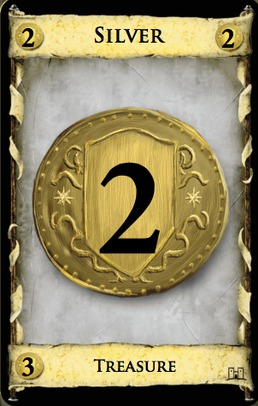
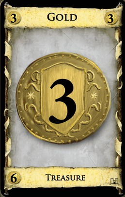

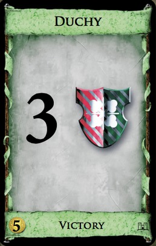
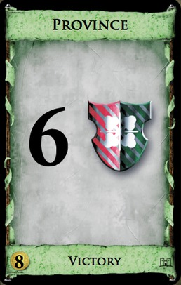
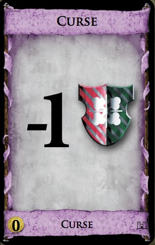
-->

<!--

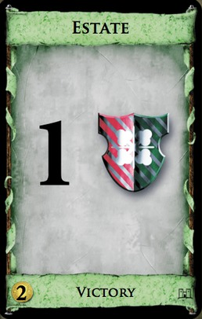

-->

#### Cartes royaume

<!--
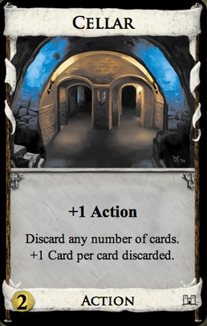
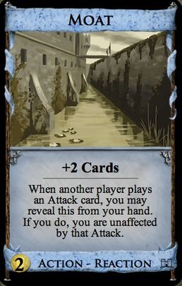
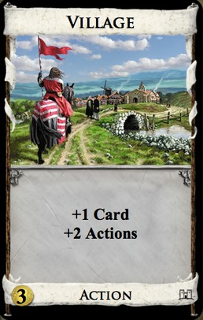
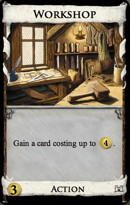
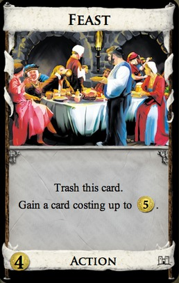
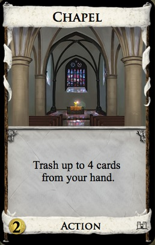
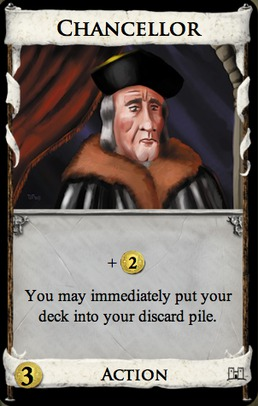
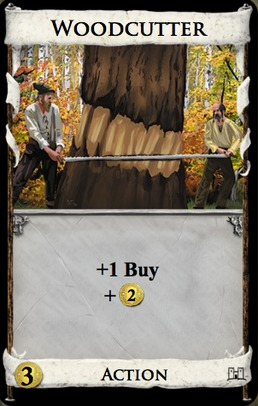
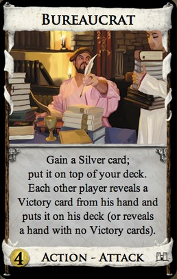
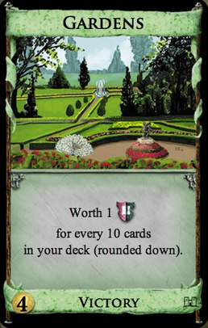
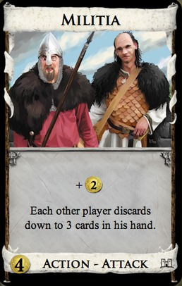
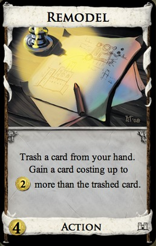
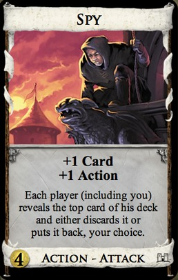
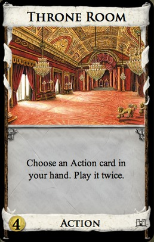
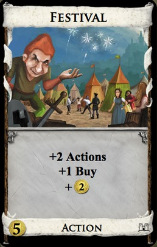
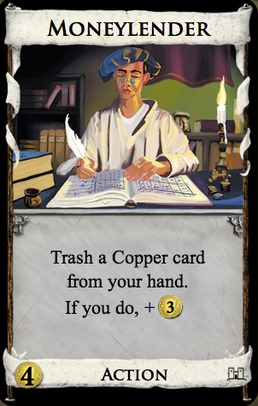
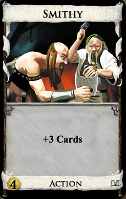
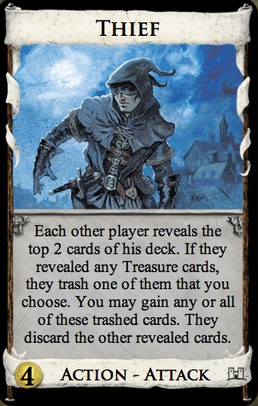
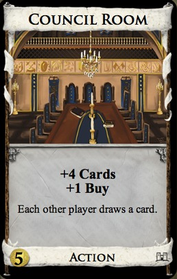
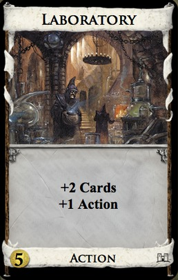
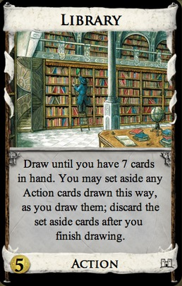
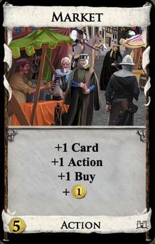
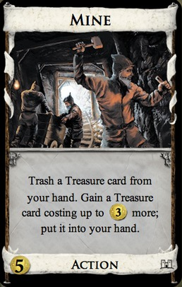
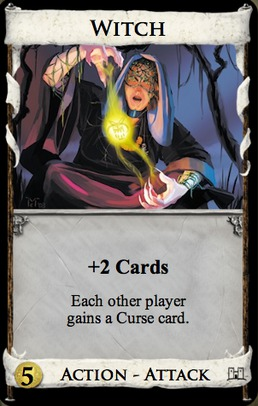
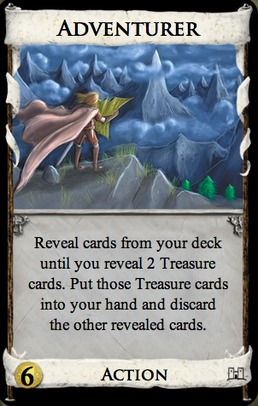

-->

Les cartes _royaume_ sont données dans un fichier à part : [Cartes Royaume](ressources/sujet/CartesRoyaumeDescription.pdf)
